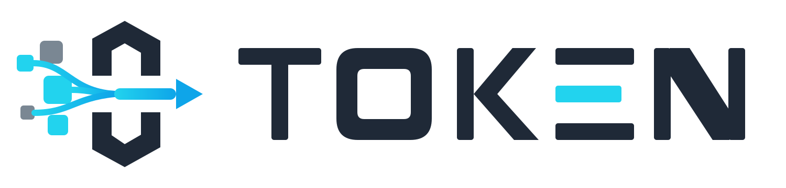
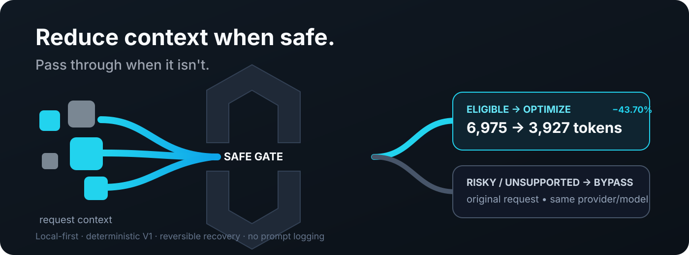
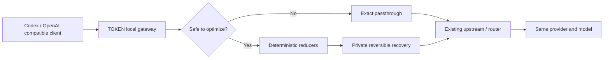

<div align="center">



### Reduce context when safe. Pass through when it isn't.

Local-first adaptive context optimization for Codex and OpenAI-compatible AI agents.

[](https://github.com/Tungvoc3199/token-runtime/actions/workflows/ci.yml)


[](https://github.com/Tungvoc3199/token-runtime/releases/tag/v0.1.0-alpha.3)

[Quickstart](#quickstart) · [Proof](#proof) · [How it works](#how-it-works) · [Safety](#safety-first-by-design) · [Compatibility](#compatibility) · [Compatibility matrix](docs/COMPATIBILITY.md) · [Security](SECURITY.md)

</div>

> **Alpha status:** Codex persistent integration is verified. TOKEN does not claim universal quality non-inferiority or guaranteed currency savings.

<div align="center">



</div>

TOKEN sits between a supported client and its OpenAI-compatible upstream. It removes deterministic redundancy only when the planner considers the request safe to optimize. Risky or unsupported requests are forwarded unchanged.

**No TLS MITM. No prompt logging. No provider/model switching.**

## Why TOKEN

- **Quality first** — saving tokens is never enough by itself.
- **Risk-aware bypass** — uncertain contexts take the original request path.
- **Deterministic V1** — no semantic or LLM summarization in the default path.
- **Reversible** — removed bytes are content-addressed in a private local recovery store.
- **Local-first** — optimization happens on the user's machine.
- **Transactional integrations** — managed config changes are hash-guarded and rollback-aware.

## Proof

### Live paired example

Same task, same route, same expected answer:

| | Without TOKEN | With TOKEN |
|---|---:|---:|
| Input tokens | 6,975 | **3,927** |
| Input reduction | — | **43.70%** |
| Result | correct | **correct** |

```text
checkout pod OOMKilled; raise memory limit and redeploy
```

The output above was identical with and without TOKEN in the paired live test.

### Final 64-workload benchmark

| Metric | Result |
|---|---:|
| Total workloads | 64 |
| Optimized | 40 |
| Deliberately bypassed | 24 |
| Eligible-workload estimated saving | **28.53%** |
| Overall corpus estimated saving | **10.61%** |
| Protected-byte fidelity | **100%** |
| Recovery-reference resolution | **100%** |

High-risk structured decision contexts are deliberately bypassed. These are estimated input-token results for the offline corpus, not a universal quality or billed-cost claim.

## How it works



TOKEN does not choose a cheaper model or silently reroute providers. The optimization boundary is the request context itself.

The V1 planner protects the active turn, protocol state, hard constraints, exact-edit material, current evidence, and decision-sensitive content. Eligible historical context can use exact duplicate removal, repeated-line collapse, recency-preserving deduplication, JSON-aware handling, and conservative tool-output reduction.

## Quickstart

Python 3.12+ is required.

Install the Alpha.3 package from PyPI after publication:

```bash
pip install token-runtime==0.1.0a3
```

Or install it as an isolated CLI tool with `uv`:

```bash
uv tool install token-runtime==0.1.0a3
```

Preview integration changes first:

```bash
token install --upstream http://127.0.0.1:20128 --root "$HOME" --dry-run
```
Apply and run:

```bash
token install --upstream http://127.0.0.1:20128 --root "$HOME"
token serve
```

Verify the path:

```bash
token doctor
token status
```

Rollback preview and uninstall:

```bash
token uninstall --root "$HOME" --dry-run
token uninstall --root "$HOME"
```

For Codex, TOKEN transactionally manages only the selected OpenAI-compatible provider `base_url`. Ambiguous provider selection or post-install config drift is refused instead of overwritten.

## Safety-first by design

| Context class | TOKEN behavior |
|---|---|
| Active/latest turn | Byte-protected |
| System/developer + protocol state | Protected |
| Hard constraints / exact-edit material | Protected or bypassed |
| Structured JSON + decision-bearing context | **Exact passthrough** |
| Unsupported/multimodal wire shapes | **Exact passthrough** |
| Eligible historical redundancy | Deterministic optimization |
| Internal parse/planner/reducer failure | Original request fallback |

## Compatibility

| Integration | Alpha status |
|---|---|
| OpenAI Responses API, text payloads | ✅ Supported |
| OpenAI Chat Completions, text payloads | ✅ Supported |
| Codex with OpenAI-compatible provider config | ✅ Transactional integration verified |
| Codex CLI 0.154.0 Responses boundary | ✅ `CERTIFIED` at the observed request/response boundary |
| Generic apps honoring `OPENAI_BASE_URL` | ✅ Supported |
| Local OpenAI-compatible gateways/routers | ✅ Supported |
| Anthropic Messages adapter/conformance | 🛡️ `PASSTHROUGH_ONLY`; offline conformance, not production gateway-wired |
| Gemini GenerateContent adapter/conformance | 🛡️ `PASSTHROUGH_ONLY`; offline conformance, not production gateway-wired |
| OpenAI Agents API managed-session conformance | 🛡️ `PASSTHROUGH_ONLY`; offline conformance only, not production routing |
| Multimodal optimization | 🛡️ `PASSTHROUGH_ONLY` |

`CERTIFIED` is always version- and boundary-specific. Canonical source can also contain adapters that are not deployed in the active gateway. See the [compatibility matrix](docs/COMPATIBILITY.md) for the exact evidence boundary.

## Operations

```bash
token doctor      # config, state, gateway and upstream health
token status      # local numeric optimization metrics
token benchmark   # run the production planner/engine on a corpus
token optimize    # inspect one request through the optimizer
token uninstall   # remove TOKEN-managed integration state
```

Telemetry uses an allowlist. Prompt bodies, authorization headers, API keys, and arbitrary request content are not persisted as metrics.

## Benchmarking

`token benchmark` uses the same planner and optimization engine as the gateway. Benchmark inputs expose context fields only; hidden grading labels are not given to the optimizer.

```bash
token benchmark --file cases.json
```

## Stable baseline

The first verified alpha baseline is locked separately from ongoing development:

- Canonical stable tag: `TOKEN-V1-ALPHA-STABLE-20260909`
- Canonical stable branch: `stable/token-v1-alpha-20260909`
- Baseline commit: `e45a09859ec3df8c7bb15589bdc096e680884175`

Canonical development continues in the private source; stable refs are not advanced with normal feature work.

## Alpha boundaries

TOKEN currently **does not claim**:

- zero quality regression for every workload;
- a universal percentage reduction for all requests;
- actual currency savings from provider billing;
- broad provider-cache non-regression;
- production native Anthropic or Gemini gateway routing;
- multimodal context optimization.

The approved 24-call live campaign found a real regression class. The final policy responds by bypassing that class unchanged rather than attempting more aggressive compression.

## Documentation

- [Security and privacy contract](SECURITY.md)
- [Claims registry](docs/CLAIMS.md)
- [Compatibility matrix](docs/COMPATIBILITY.md)
- [Threat model](docs/THREAT-MODEL.md)
- [Release process](docs/RELEASE-PROCESS.md)
- [GitHub governance](docs/GITHUB-GOVERNANCE.md)
- [Public benchmark](benchmarks/README.md)
- [v0.1.0-alpha.3 release notes](docs/releases/v0.1.0-alpha.3.md)
- [Apache-2.0 license](LICENSE)

---

**Design principle:** optimize the context only when doing so is safer than leaving it alone.
